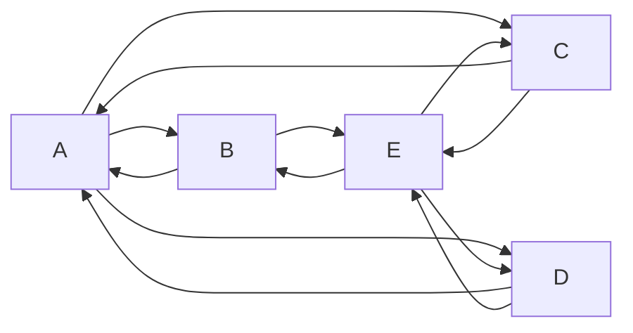

# A demo of `vue-markdown-viewer`

`vue-markdown-viewer` is a markdown component for Vue.

## Overview

- Follows [CommonMark](https://commonmark.org)
- Optionally follows [GitHub Flavored Markdown](https://github.github.com/gfm/)
- Lets you define your own components (to render `MyHeading` instead of `h1`)
- Has a lot of plugins

## Table of contents

Here is an example of a plugin in action ([`remark-toc`](https://github.com/remarkjs/remark-toc)).

This section is replaced by an actual table of contents.

## Syntax highlighting

Here is an example of a plugin to highlight code: [rehype-highlight](https://github.com/rehypejs/rehype-highlight).


```html
<script lang="ts" setup>
import { VueMdRender } from 'vue-markdown-viewer'
import rehypeHighlight from 'rehype-highlight'
</script>

<template>
  <vue-markdown-viewer :rehype-plugins="[rehypeHighlight]"># Your markdown here</vue-markdown-viewer>
</template>
```

## Math

Render Math with [remark-math](https://github.com/remarkjs/remark-math)
and [rehype-katex](https://github.com/remarkjs/remark-math/tree/main/packages/rehype-katex).

Inline: $
% \f is defined as #1f(#2) using the macro
\f\relax{x} = \int_{-\infty}^\infty
\f\hat\xi\,e^{2 \pi i \xi x}
\,d\xi
$

Block:

$$
% \f is defined as #1f(#2) using the macro
\f\relax{x} = \int_{-\infty}^\infty
\f\hat\xi\,e^{2 \pi i \xi x}
\,d\xi
$$

## Mermaid

Extends `code` to render mermaid.



## GitHub flavored markdown (GFM)

For GFM, you can _also_ use a plugin:
[`remark-gfm`](https://github.com/remarkjs/remark-gfm).
It adds support for GitHub-specific extensions to the language:
tables, strikethrough, tasklists, and literal URLs.

These features **do not work by default**.
👆 Use the toggle above to add the plugin.

|    Feature | Support              |
| ---------: | :------------------- |
| CommonMark | 100%                 |
|        GFM | 100% w/ `remark-gfm` |

~~strikethrough~~

- [ ] task list
- [x] checked item

## HTML in markdown

⚠️ HTML in markdown is quite unsafe, but if you want to support it, you can
use [`rehype-raw`](https://github.com/rehypejs/rehype-raw).
You should probably combine it with
[`rehype-sanitize`](https://github.com/rehypejs/rehype-sanitize).

<blockquote>
  👆 Use the toggle above to add the plugin.
</blockquote>

<video width="320" height="240" controls>
  <source src="http://techslides.com/demos/sample-videos/small.mp4" type="video/mp4">
</video>

## Components

You can pass components to change things:

```html
<script lang="ts" setup>
import { VueMdRender } from 'vue-markdown-viewer'
import MyFancyRule from './components/my-fancy-rule.js'

const renderHr = (properties) => MyFancyRule
</script>

<template>
  <vue-markdown-viewer
    :components="{
    <!-- Use h2s instead of h1s -->
    h1: 'h2',
    <!-- Use a component instead of hrs -->
    hr: renderHr />
  }"
  >
    # Your markdown here
  </vue-markdown-viewer>
</template>
```
